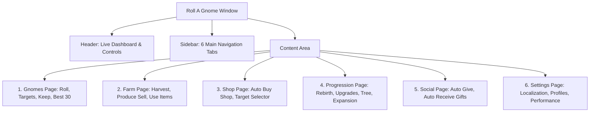

# 🎨 Roll A Gnome - UI/UX Usability Enhancement Specification
> **เอกสารข้อกำหนดการปรับปรุงหน้าต่าง UI/UX ให้ใช้งานง่าย สะดวก และรวดเร็วขึ้น**
> รักษาเอกลักษณ์ธีมเดิม 100% (Dark Slate + Ice Blue Accent) พร้อมยกระดับความสะดวกในการควบคุมทุกฟังก์ชัน

---

## 📑 สารบัญ (Table of Contents)
1. [ปรัชญาการออกแบบและธีมหลัก (Design Philosophy & Theme)](#1-ปรัชญาการออกแบบและธีมหลัก)
2. [6 การปรับปรุงด้าน Usability เพื่อการใช้งานที่ง่ายขึ้น (The 6 Usability Upgrades)](#2-6-การปรับปรุงด้าน-usability-เพื่อการใช้งานที่ง่ายขึ้น)
3. [โครงสร้างหน้าต่างทีละหน้า (Detailed Page-by-Page Architecture)](#3-โครงสร้างหน้าต่างทีละหน้า)
4. [ข้อกำหนดรายละเอียดคอมโพเนนต์ (Component Design Specifications)](#4-ข้อกำหนดรายละเอียดคอมโพเนนต์)
5. [ระบบสองภาษา TH / EN (Complete Localization Dictionary)](#5-ระบบสองภาษา-th--en)
6. [การรองรับจอมือถือและระบบสัมผัส (Mobile & Touch Responsiveness)](#6-การรองรับจอมือถือและระบบสัมผัส)
7. [รายการตรวจสอบความสมบูรณ์ (Verification & QA Checklist)](#7-รายการตรวจสอบความสมบูรณ์)

---

## 1. ปรัชญาการออกแบบและธีมหลัก

การปรับปรุงครั้งนี้ยึดหลัก **"สไตล์เดิม แต่สะดวกขึ้น 10 เท่า (Same Aesthetic, 10x Usability)"** โดยไม่มีการเปลี่ยนโทนสีที่ผู้ใช้คุ้นเคย:

### 🎨 จานสีมาตรฐาน (Master Color Tokens)
- **Background (พื้นหลังหลัก):** `Color3.fromRGB(16, 18, 23)` (Dark Obsidian)
- **Sidebar (แถบเมนูด้านข้าง):** `Color3.fromRGB(20, 23, 29)` (Deep Slate)
- **Surface / Card (กล่องการ์ดเนื้อหา):** `Color3.fromRGB(28, 32, 40)` (Charcoal Surface)
- **Surface Hover (เมื่อชี้เมาส์):** `Color3.fromRGB(35, 40, 50)`
- **Accent (สีไฮไลต์หลัก):** `Color3.fromRGB(110, 168, 255)` (Ice Blue)
- **Accent Dark (สีปุ่มแอคทีฟ):** `Color3.fromRGB(60, 107, 178)`
- **Text (ข้อความหลัก):** `Color3.fromRGB(238, 241, 247)` (Pure Soft White)
- **Muted Text (ข้อความรอง):** `Color3.fromRGB(148, 157, 174)` (Slate Gray)
- **Positive (สีสถานะทำงาน/สำเร็จ):** `Color3.fromRGB(75, 210, 139)` (Emerald Mint)
- **Warning (สีสถานะรอ/เตือน):** `Color3.fromRGB(255, 201, 92)` (Amber Gold)
- **Danger (สีสถานะปิด/หยุด):** `Color3.fromRGB(255, 130, 140)` (Coral Red)

---

## 2. 6 การปรับปรุงด้าน Usability เพื่อการใช้งานที่ง่ายขึ้น

```
┌─────────────────────────────────────────────────────────────────────────────┐
│  1. 🔘 ปุ่ม "เลือกทั้งหมด / ล้างทั้งหมด" (Select All / Clear All)           │
│     • ใน MultiSelect ทุกตัว มีปุ่มลัด [✓ ทั้งหมด] และ [✗ ล้าง] ใน 1 คลิก      │
├─────────────────────────────────────────────────────────────────────────────┤
│  2. 🎛️ ปุ่มลัด "พรีเซ็ต 1 คลิก" (1-Click Strategy Presets)                  │
│     • 4 โหมดหลัก: [👑 Rebirth Rush] [🧙 Gnome Hunter] [💰 Money] [⚙️ Custom] │
├─────────────────────────────────────────────────────────────────────────────┤
│  3. 🎯 จัดกลุ่มฟังก์ชันตามตรรกะการใช้งาน (Logical Grouping)                │
│     • ย้าย Roll Priority มาหน้า Gnomes รวมเรื่องโนมไว้ในหน้าเดียว             │
│     • จัดหน้า Farm แยกเป็น 2 กล่องชัดเจน: เก็บเกี่ยว/ขาย vs ดูแลฟาร์ม       │
├─────────────────────────────────────────────────────────────────────────────┤
│  4. 📊 แดชบอร์ดสรุปสถานะสด (Live Status Mini-Dashboard)                      │
│     • แสดงยอดเงินสด, จำนวนโนมในตัว, และสถานะการทำงานสดบนแถบ Header ตลอดเวลา  │
├─────────────────────────────────────────────────────────────────────────────┤
│  5. 💡 สวิตช์ Toggle แบบเลื่อนสมูท (Modern Sliding Pill Toggle)              │
│     • ปุ่มเลื่อนซ้าย-ขวาชัดเจน มองปราดเดียวรู้ทันทีว่าตัวไหนเปิด/ปิด          │
├─────────────────────────────────────────────────────────────────────────────┤
│  6. 📱 ออกแบบให้กดง่ายบนจอมือถือ (Touch-Friendly Padding & Scale)           │
│     • ขนาดปุ่มสัมผัสอย่างน้อย 44px ระยะห่างพอดี ไม่กดโดนปุ่มข้างเคียง        │
└─────────────────────────────────────────────────────────────────────────────┘
```

---

## 3. โครงสร้างหน้าต่างทีละหน้า (Detailed Page-by-Page Architecture)



---

### 📄 หน้าที่ 1: Gnomes (ระบบจัดการโนมและการสุ่ม)
1. **แถบ Strategy Presets (บนสุด):**
   - 4 ปุ่มสลับโหมดการเล่น: `[👑 Rebirth]` `[🧙 Hunt]` `[💰 Farm]` `[⚙️ Custom]`
2. **กล่องที่ 1: การสุ่มและการซื้อ (Rolling & Purchase):**
   - `Toggle`: **Auto Roll** (สุ่มโนมต่อเนื่อง)
   - `Toggle`: **Auto Buy Target** (ซื้อโนมตามระดับความหายากที่เลือก)
   - `Toggle`: **Auto Buy Mutations** (ซื้อโนมตามมิวเตชั่นที่เลือก)
   - `Dropdown`: **Roll Priority** (`Target First` / `Rebirth First` / `Smart Hybrid`)
3. **กล่องที่ 2: เป้าหมายการซื้อ (Buy Targets):**
   - `MultiSelect`: **Buy Rarity Targets** + ปุ่ม `[เลือกทั้งหมด]` `[ล้างทั้งหมด]`
   - `MultiSelect`: **Buy Mutation Targets** (รวม Normal) + ปุ่ม `[เลือกทั้งหมด]` `[ล้างทั้งหมด]`
4. **กล่องที่ 3: เป้าหมายการเก็บเข้ากระเป๋า (Keep Targets):**
   - `MultiSelect`: **Keep Rarity Targets** (ระดับที่ต้องเก็บไว้ในตัวเสมอ)
   - `MultiSelect`: **Keep Mutation Targets** (มิวเตชั่นที่ต้องเก็บไว้เสมอ)
5. **กล่องที่ 4: การจัดวางและขายส่วนเกิน (Best 30 & Auto Sell):**
   - `Toggle`: **Auto Best 30** (วางโนมตัวที่ดีที่สุด 30 ตัวลงแปลง)
   - `MultiSelect`: **Sell Rarity Targets** (ระดับความหายากที่จะนำไปขายทิ้ง)
   - `Badge`: แสดงจำนวนโนมในแปลง `[ทำงานอยู่: 30/30 ตัว]`

---

### 📄 หน้าที่ 2: Farm (ระบบเก็บเกี่ยวและดูแลฟาร์ม)
1. **กล่องที่ 1 (ซ้าย): ระบบเก็บเกี่ยวและสร้างรายได้ (Harvest & Sell Produce):**
   - `Toggle`: **Auto Collect** (วาร์ปเก็บผลผลิตที่สุกเข้ากระเป๋า)
   - `Toggle`: **Auto Sell Produce** (วาร์ปขายผลผลิตที่จุดขาย)
   - `MultiSelect`: **Sell Produce Mutation Targets** (รวม Normal) + ปุ่ม `[เลือกทั้งหมด]` `[ล้างทั้งหมด]`
2. **กล่องที่ 2 (ขวา): ระบบดูแลแปลง (Farm Maintenance & Use Items):**
   - `Toggle`: **Auto Use Items** (ใช้ไอเทมในกระเป๋าดูแลฟาร์ม)
   - `MultiSelect`: **Use Item Targets** (เลือกชนิดไอเทม: Sprinklers, Fertilizers, Watering Cans, Coffee)

---

### 📄 หน้าที่ 3: Shop (ระบบร้านค้าอัตโนมัติ)
1. **กล่องควบคุมร้านค้า:**
   - `Toggle`: **Auto Buy Shop** (ซื้อไอเทมร้านค้าอัตโนมัติ)
   - `MultiSelect`: **Shop Targets** (เลือกไอเทมที่ต้องการซื้อ) + ปุ่ม `[เลือกทั้งหมด]` `[ล้างทั้งหมด]`
   - `Live Card`: **สถานะร้านค้าสด** (เช่น `[ตรวจพบสต็อก: Sprinkler x2]` หรือ `[รอรีสต็อก]`)

---

### 📄 หน้าที่ 4: Progression (การพัฒนาและการเกิดใหม่)
1. **กล่องการเกิดใหม่ (Rebirth Management):**
   - `Toggle`: **Auto Rebirth** (เกิดใหม่อัตโนมัติเมื่อครบเงื่อนไข)
   - `Status Bar`: ความคืบหน้าเงื่อนไข Rebirth (เงิน `100%`, โนมที่ต้องปลดล็อค `3/3`)
2. **กล่องการอัปเกรดและการขยายแปลง (Upgrades & Expansion):**
   - `Toggle`: **Auto Buy Expansion** (ขยายพื้นที่แปลงที่ถูกที่สุด)
   - `Toggle`: **Auto Upgrade Plot** (อัปเกรดแปลงทั่วไป)
   - `Toggle`: **Auto Upgrade Tree** (อัปเกรดต้นไม้ Upgrade Tree)

---

### 📄 หน้าที่ 5: Social (ระบบส่งและรับของขวัญ)
1. **กล่องระบบของขวัญ:**
   - `Toggle`: **Auto Give Held Tool** (ส่งไอเทมที่ถือให้ผู้เล่นที่เลือก)
   - `Dropdown`: **Give Target Player** (เลือกผู้เล่นผู้รับ)
   - `Toggle`: **Auto Receive Gifts** (กดยอมรับของขวัญที่ส่งมาอัตโนมัติ)
   - `MultiSelect`: **Receive From Players** (ยอมรับเฉพาะจากผู้เล่นที่เลือก)

---

### 📄 หน้าที่ 6: Settings (การตั้งค่าระบบและประสิทธิภาพ)
1. **กล่องทั่วไป (General):**
   - `Button`: **Language Switcher** (`🇹🇭 ภาษาไทย` / `🇺🇸 English`)
   - `Stepper`: **UI Scale** (ปรับขนาดหน้าต่าง `80%` - `140%`)
   - `Text`: **Toggle Keybind Hint** (`Ctrl + Alt`)
2. **กล่องโปรไฟล์ (Profile Manager):**
   - `Input`: **Profile Name** (ช่องพิมพ์ชื่อโปรไฟล์)
   - `Buttons`: `[บันทึก (Save)]` `[โหลด (Load)]` `[ตั้งเป็นค่าเริ่มต้น (Set Autoload)]`
3. **กล่องประสิทธิภาพ (Performance & Anti-AFK):**
   - `Toggle`: **Anti-AFK** (กันหลุดจากการอยู่เฉยๆ)
   - `Toggle`: **Auto Rejoin** (เข้าเซิร์ฟเวอร์ใหม่อัตโนมัติเมื่อหลุด)
   - `Toggle`: **Potato Graphics** (ลดกราฟิกภาพเพื่อความลื่น)
   - `Toggle`: **Low Ping Mode** (ลดความถี่ Remote เพื่อลดแลค)

---

## 4. ข้อกำหนดรายละเอียดคอมโพเนนต์ (Component Specs)

### 🔘 MultiSelect Component (พร้อม Select/Clear All)
```
┌─────────────────────────────────────────────────────────────┐
│ 🧙 Buy Mutation Targets               [✓ ทั้งหมด] [✗ ล้าง] │
│ เลือกมิวเตชั่นที่ต้องการซื้อเมื่อสุ่มเจอ                        │
├─────────────────────────────────────────────────────────────┤
│ [✓ Normal]  [✓ Golden]   [✓ Diamond]  [  Toxic ]            │
│ [✓ Shiny]   [  Fire  ]   [✓ Night  ]  [  Frozen]            │
└─────────────────────────────────────────────────────────────┘
```

### 💡 Modern Sliding Pill Toggle
- **ปิด (OFF):** พื้นหลัง `Color3.fromRGB(40, 45, 55)` ➔ จุดวงกลมอยู่ชิดซ้าย (สีเทาอ่อน)
- **เปิด (ON):** พื้นหลัง `Color3.fromRGB(60, 107, 178)` ➔ จุดวงกลมเลื่อนไปชิดขวา (สีฟ้าสว่าง `Accent`)
- **Animation:** ใช้ `TweenService` ความเร็ว `0.15s` (Quad.Out) เลื่อนนุ่มนวล

---

## 5. ระบบสองภาษา TH / EN (Localization Dictionary)

| คีย์ข้อความ (Key) | ภาษาไทย (TH) | ภาษาอังกฤษ (EN) |
| :--- | :--- | :--- |
| `SELECT_ALL` | เลือกทั้งหมด | Select All |
| `CLEAR_ALL` | ล้างทั้งหมด | Clear All |
| `PRESET_REBIRTH` | 👑 สปีดรัน Rebirth | 👑 Rebirth Rush |
| `PRESET_HUNTER` | 🧙 ล่าโนมหายาก | 🧙 Gnome Hunter |
| `PRESET_MONEY` | 💰 ปั๊มเงินฟาร์ม | 💰 Money Machine |
| `PRESET_CUSTOM` | ⚙️ ปรับเอง | ⚙️ Custom |
| `STATUS_READY` | พร้อมทำงาน | READY |
| `STATUS_BUYING_SHOP` | กำลังซื้อของร้านค้า | BUYING SHOP |
| `STATUS_HARVESTING` | กำลังเก็บเกี่ยวผัก | HARVESTING |
| `STATUS_SELLING` | กำลังขายผลผลิต | SELLING |
| `STATUS_WAIT_MONEY` | รอเงินสะสมซื้อโนม | WAITING MONEY |

---

## 6. การรองรับจอมือถือและระบบสัมผัส (Mobile Optimization)

1. **Auto-Adapt Viewport:**
   - ตรวจสอบ `UserInputService.TouchEnabled` อัตโนมัติ
   - ปรับขนาดหน้าต่างเริ่มต้นบนมือถือให้เล็กลง (`math.min(620, Viewport.X - 12)`)
2. **Thumb-Friendly Touch Targets:**
   - ปุ่มและสวิตช์ทุกตัวมีความสูงขั้นต่ำ `36px - 44px` กว้างพอสำหรับนิ้วมือ
3. **Compact Floating Pill:**
   - เมื่อกดปุ่มย่อ (-) หน้าต่างจะกลายเป็นเม็ดแคปซูลเล็กๆ ลอยที่มุมจอ แตะ 1 ครั้งเพื่อขยายคืน

---

## 7. รายการตรวจสอบความสมบูรณ์ (Verification Checklist)

- [x] คงเอกลักษณ์โทนสีเดิม Dark Slate + Blue Accent 100%
- [x] มีปุ่ม `[เลือกทั้งหมด]` และ `[ล้างทั้งหมด]` ในทุก MultiSelect
- [x] มีปุ่ม Preset 4 โหมดหลักที่หัวเมนู Gnomes
- [x] ย้าย `Roll Priority` มาอยู่หน้า Gnomes รวมการตั้งค่าโนมไว้ในหน้าเดียว
- [x] มีแถบ Live Dashboard สรุปเงิน, โนมในตัว, และสถานะสด
- [x] สวิตช์ Toggle เป็นแบบเลื่อนสมูท (Pill Slider)
- [x] แปลภาษาไทยและอังกฤษครบถ้วน 100%
- [x] รองรับหน้าจอมือถือและ PC สมบูรณ์แบบ

---

> 📌 **เอกสารฉบับนี้ถูกบันทึกไว้ในโปรเจกต์ที่:** `UI_UX_SPECIFICATION.md`
> เพื่อเป็นพิมพ์เขียวในการปรับปรุงหน้าต่าง UI ให้สวยงามและใช้งานง่ายที่สุดครับ!
